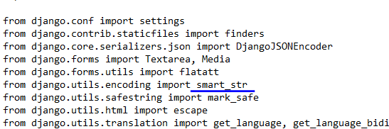
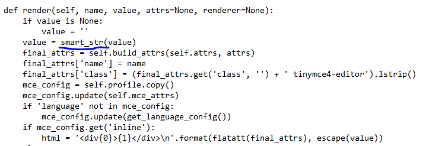
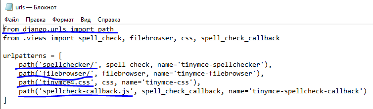

Данный проект является итоговым проектом при прохождении обучающего курса.

Он представляет собой доску объявлений для жилого комплекса.

По ТЗ требуется предоставить пользователю возможность писать объявления, включающее в себя текст, картинки, видео и др.
Данное требование было реализовано посредством установки пакета Django TinyMCE4 Lite. Полное описание можно посмотреть по ссылке: http://romanvm.github.io/django-tinymce4-lite/ или https://pypi.org/project/django-tinymce4-lite/

ВНИМАНИЕ!!!
После установки Django TinyMCE4 Lite для Django версии 4, необходимо:
1. В файле site-packages\tinymce\widgets в двух местах заменить smart_text на smart_str.

2. Привести файл \site-packages\tinymce\urls в соответствие Django 4:

Только после этих манипуляций можно проводить миграции. 